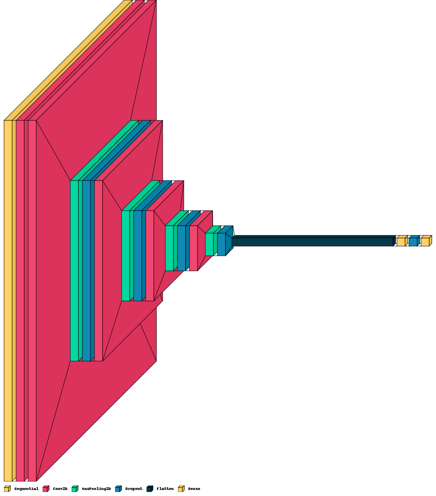

# Covid19-Detection

This is a work in progress project.

## Model Architecture
</img>

## Usage

1. Load the `CovidDetection.ipynb' file into a Google Colab project.
2. Run the Colab runtime with the GPU.
3. Once the code gets to the normal dataset download step, upload your `kaggle.json` config file from your caggle settings.
